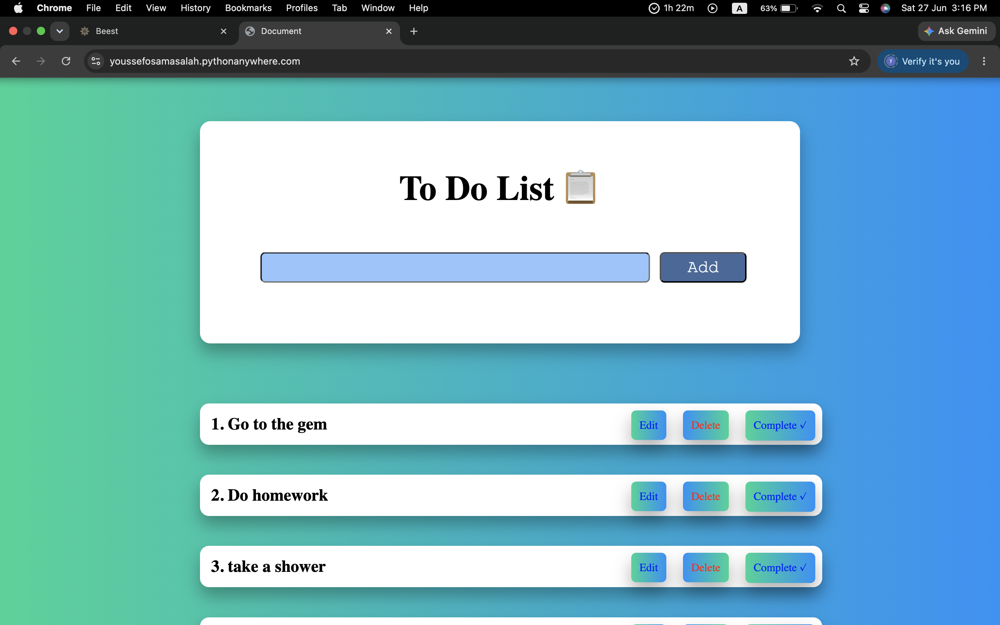
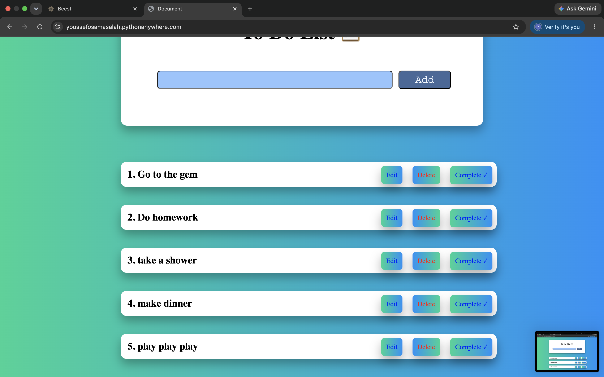
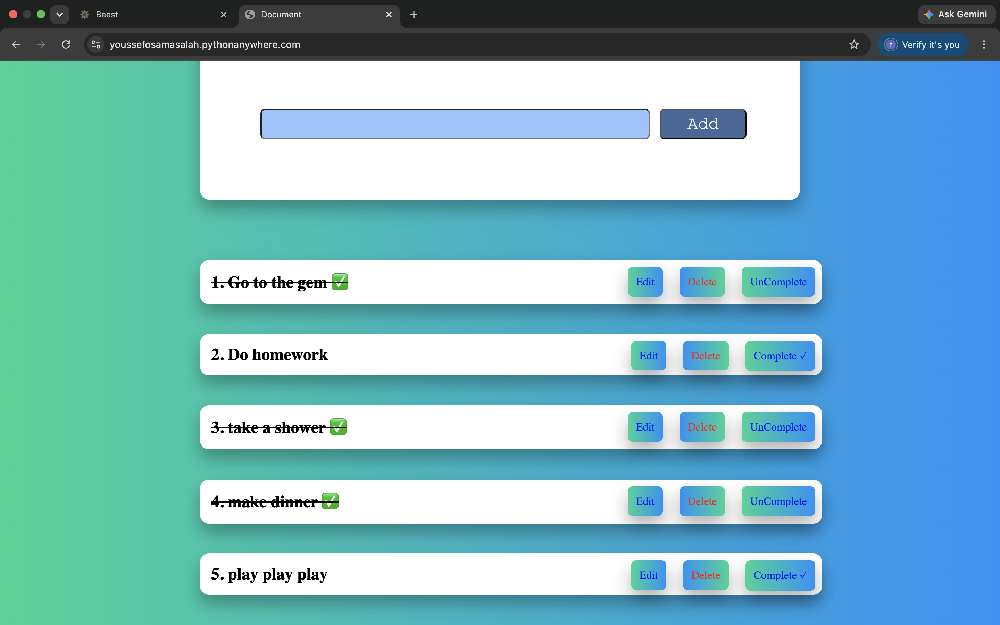
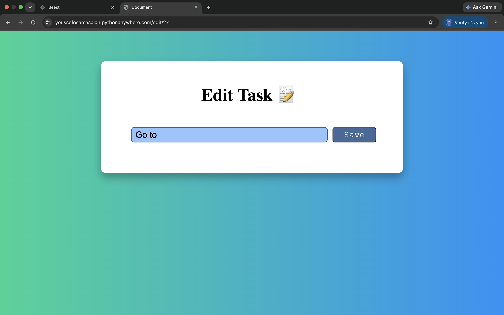
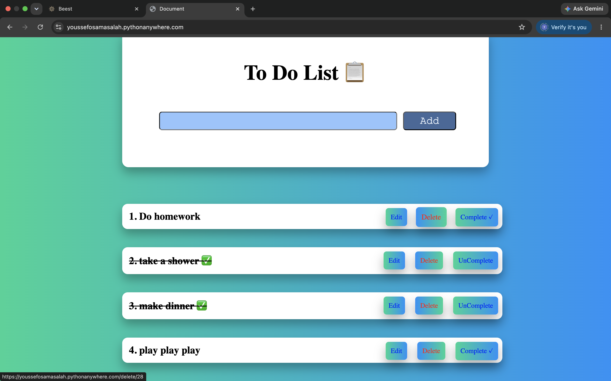

# To Do List (My first flask project)

This project is my first project using flask and i mainly built it to learn Flask and improve my backend development skills

--
## Anout The Project 

This is a simple and clean To Do List application 

You can:
- Add new tasks
- Edit tasks
- Delete tasks
- Mark task as completed

The goal of this project was to practice building web applications with flask while creating something useful and organized

--
## What I Learnd

- More about Flask basics and how it works
- How to use Jinja2 templating in HTML
- How to work with SQLite Database
- Some new CSS concepts and styling techniques

--
## Project experience

link:
https://youssefosamasalah.pythonanywhere.com/

--
## Technologies Used 

- Python 
- Flask
- HTML
- CSS
- SQLite

# Images

#### 1. This is what the project looks like when opend and agter adding some tasks

#### 2. The layout of all tasks

#### 3. When you press the 'Complete' button The completed task appears like this

#### 4. Clicking the edit button opens this page

#### 5. You can edit the task here and save it 

#### 6. When you click 'Delete' it disappears of course

